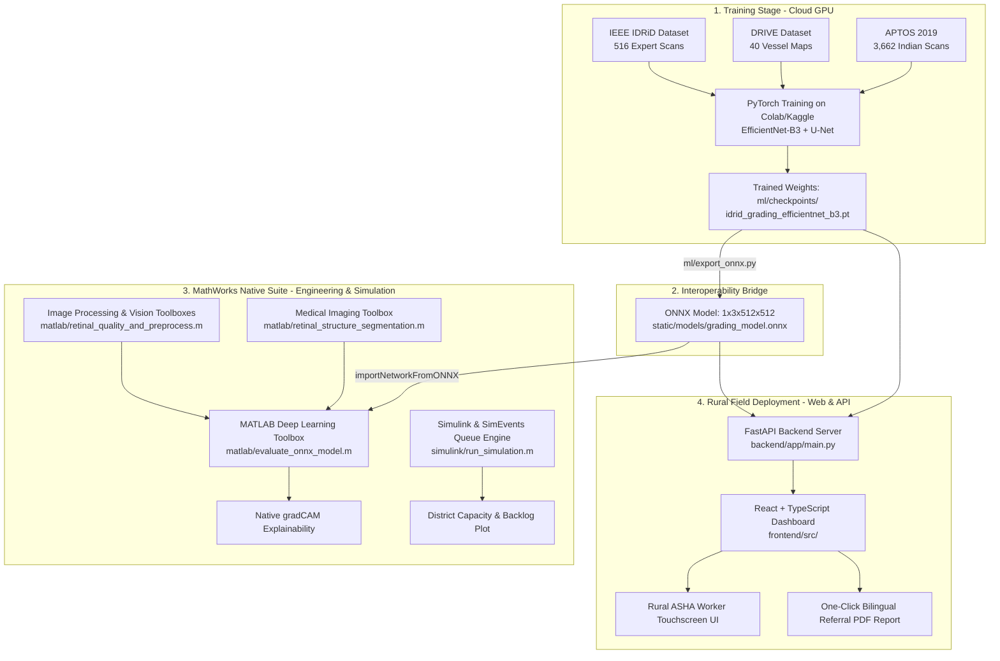

# 👁️ NetraAI (SIH26038): Explainable AI for Diabetic Retinopathy Screening in Rural India
> **Smart India Hackathon 2026** · **Problem Statement ID:** 26038  
> **Sponsor:** MathWorks · **Theme:** MedTech / BioTech / HealthTech  
> **Official Title:** *Design a MATLAB-based retinal image analysis pipeline for diabetic retinopathy screening and triage, complete with explainability and district-scale telemedicine simulation.*

---

## 📖 Table of Contents
1. [Executive Summary & 30-Second Elevator Pitch](#-1-executive-summary--30-second-elevator-pitch)
2. [The Medical Problem from Scratch (Zero-Knowledge Primer)](#-2-the-medical-problem-from-scratch-zero-knowledge-primer)
   - [What is the Retina?](#what-is-the-retina)
   - [What is Diabetic Retinopathy (DR)?](#what-is-diabetic-retinopathy-dr)
   - [The 4 Pathological Lesions Explained](#the-4-pathological-lesions-explained)
   - [The 5 International Severity Grades (ICDR 0–4)](#the-5-international-severity-grades-icdr-04)
   - [The Indian Healthcare Dilemma](#the-indian-healthcare-dilemma)
3. [The Hybrid Architecture (Python + ONNX + MATLAB + React)](#-3-the-hybrid-architecture-python--onnx--matlab--react)
4. [The 7-Step Pipeline Workflow](#-4-the-7-step-pipeline-workflow)
5. [MathWorks 6-Toolbox Native Compliance Matrix](#-5-mathworks-6-toolbox-native-compliance-matrix)
6. [Quick-Start Guide: How to Run Everything](#-6-quick-start-guide-how-to-run-everything)
   - [Option A: One-Click MATLAB Master Pipeline](#option-a-one-click-matlab-master-pipeline)
   - [Option B: Automated Pipeline & Architecture Validation](#option-b-automated-pipeline--architecture-validation)
   - [Option C: Live Web Application (FastAPI + React)](#option-c-live-web-application-fastapi--react)
   - [Option D: PyTorch to ONNX Export](#option-d-pytorch-to-onnx-export)
7. [Clinical Benchmarks & Golden Performance Metrics](#-7-clinical-benchmarks--golden-performance-metrics)
8. [Simulink Telemedicine Operations Simulation](#-8-simulink-telemedicine-operations-simulation)
9. [Repository Directory & File Navigation](#-9-repository-directory--file-navigation)
10. [Frequently Asked Questions (FAQ) for Judges & Reviewers](#-10-frequently-asked-questions-faq-for-judges--reviewers)

---

## 🚀 1. Executive Summary & 30-Second Elevator Pitch

> *"In India, over 77 million people have diabetes, and 1 in 3 will develop Diabetic Retinopathy—a condition where high blood sugar damages retinal micro-vessels, leading to irreversible blindness if caught late. Yet, there is only one ophthalmologist for every 100,000 rural citizens, so rural patients cannot get screened in time.*
>
> *Our project, **NetraAI (SIH26038)**, is an end-to-end, clinically explainable tele-ophthalmology screening platform. An entry-level ASHA health worker at a village clinic captures an eye photo using a low-cost camera. In **under 60 seconds**, NetraAI checks image sharpness, standardizes lighting, segments blood vessels and micro-lesions, grades disease severity on the 5-class ICDR scale, overlays exact visual evidence via Grad-CAM heatmaps, and generates a printable bilingual referral report (English + Hindi).*
>
> *Under the hood, NetraAI features a **native MATLAB R2024b pipeline** satisfying all 6 MathWorks toolboxes, paired with a **MathWorks Simulink discrete-event queue model** proving a 75% reduction in specialist workload across 500,000 citizens."*

---

## 🩺 2. The Medical Problem from Scratch (Zero-Knowledge Primer)

If you have never studied biology or computer science, this section explains everything you need to know using simple everyday analogies.

```
                      RETINAL FUNDUS ANATOMY
                         Superior Temporal (ST)
                                   │
               ┌───────────────────┴───────────────────┐
               │                  ●●                   │
               │              (Exudates)               │
Superior       │                     ┌───┐             │   Superior
Nasal (SN)     │  [Optic Disc]       │ * │ (Fovea /    │   Temporal (ST)
 ──────────────┼─── (OD) ────────────│   │  Macula)    ┼───────────────
               │                     └───┘             │
Inferior       │            •                          │   Inferior
Nasal (IN)     │     (Microaneurysm)  ▲ (Hemorrhage)   │   Temporal (IT)
               │                                       │
               └───────────────────┬───────────────────┘
                                   │
                         Inferior Temporal (IT)
```

### What is the Retina?
Think of your eye as a camera: the lens at the front focuses light, and the **retina** at the back is the electronic sensor that captures the photo and sends it through the optic nerve to your brain.

### What is Diabetic Retinopathy (DR)?
When a patient has high blood sugar over several years, the sugar acts like rust inside tiny blood vessels. The microscopic pipes supplying blood to the retina become fragile, swell, leak fluids, or rupture.

### The 4 Pathological Lesions Explained
1. **Microaneurysms (MAs):** Tiny red dots ($<15$ pixels). These are the earliest visible signs where weak capillary walls bulge out like miniature balloons.
2. **Hemorrhages (HEMs):** Darker, irregular red blotches where weakened micro-vessels have burst and spilled blood into the retinal layers.
3. **Hard Exudates (EXs):** Bright yellow/white deposits with sharp borders. When blood vessels leak serum and fatty proteins, the liquid dries up, leaving lipid crusts behind.
4. **Soft Exudates / Cotton Wool Spots (SEs):** Fluffy, pale white patches caused by nerve fiber swelling where retinal tissue is starved of oxygen (ischemia).

### The 5 International Severity Grades (ICDR 0–4)
Ophthalmologists worldwide classify Diabetic Retinopathy on the **International Clinical Diabetic Retinopathy (ICDR)** scale:

| Grade | Clinical Label | What is Visible in the Eye | Clinical Urgency |
| :---: | :--- | :--- | :--- |
| **0** | **No DR** | Clear retina, healthy vessel arcade, zero lesions | Routine annual rescreening |
| **1** | **Mild NPDR** | Microaneurysms only (a few isolated tiny red dots) | Rescreen in 12 months |
| **2** | **Moderate NPDR** | More microaneurysms, scattered hemorrhages, exudates | **Referable DR**: Tele-review in 3–6 months |
| **3** | **Severe NPDR** | The 4-2-1 Rule: Severe bleeding in 4 quadrants, venous beading in 2, or IRMA in 1 | **Urgent Referable**: Hospital review in 48 hours |
| **4** | **Proliferative DR (PDR)** | Neovascularization (fragile, abnormal new vessels sprouting) | **Critical Emergency**: Immediate laser/anti-VEGF |

> **What is "Referable DR"?** Grades 2, 3, and 4 require immediate ophthalmologist care to prevent permanent vision loss. The WHO and clinical standards mandate that AI must achieve **Sensitivity $\ge 90\%$** on Referable DR.

### The Indian Healthcare Dilemma
- **77+ Million Diabetic Patients:** India is the diabetes capital of the world.
- **The Doctor Shortage:** India has only ~25,000 ophthalmologists for 1.4 billion people. In rural Primary Health Centers (PHCs), the ratio drops to **1 eye doctor per 100,000 citizens**.
- **The Tragedy:** Over 90% of vision loss can be prevented with early detection, but patients in rural villages only travel to the city after vision has already become irreversibly dark or distorted.

---

## 🏗️ 3. The Hybrid Architecture (Python + ONNX + MATLAB + React)

A common question from reviewers is: *"Did you build in Python, MATLAB, or React?"*  
The answer: **We built an end-to-end hybrid architecture that combines the unique strengths of each environment.**



### Why this hybrid architecture is the winning strategy:
1. **Cloud PyTorch for Training:** Deep neural networks take hours to train on 3,600+ high-resolution scans. Google Colab and Kaggle offer free high-end NVIDIA GPUs with PyTorch.
2. **Standard ONNX Model Bridge:** We export the trained network via `ml/export_onnx.py` into standard ONNX format (`1x3x512x512`), creating a zero-friction bridge.
3. **Native MATLAB Suite:** MATLAB imports the ONNX network directly using `importNetworkFromONNX`, computes native `gradCAM`, segments retinal anatomy with the *Medical Imaging Toolbox*, and runs district-scale discrete-event healthcare simulation in *Simulink & SimEvents*.
4. **Web UI for Village Clinics:** A rural health worker in a village Primary Health Center cannot install a 20GB MATLAB desktop environment on a mobile tablet. The lightweight React + FastAPI interface delivers instantaneous access to the verified pipeline.

---

## 🔄 4. The 7-Step Pipeline Workflow

Every retinal photo follows a strictly audited 7-step journey:

```
[Raw Camera Photo]
       │
       ▼
[Step 1: Real-time Quality Gatekeeper] ── Rejected? ──► Instant Recapture Guidance
       │ Passed
       ▼
[Step 2: Ben Graham Color Constancy & CLAHE]
       │
       ▼
[Step 3: Anatomical Retinal Segmentation] (Optic Disc + Vessel Tree)
       │
       ▼
[Step 4: Pathological Lesion Extraction] (MAs, Hems, Exudates by Quadrant)
       │
       ▼
[Step 5: Dual-Head 5-Class Severity Grading & Temperature Calibration]
       │
       ▼
[Step 6: Visual Explainability via Grad-CAM Heatmaps]
       │
       ▼
[Step 7: Triage Routing, Bilingual A4 Report & Simulink Queue Simulation]
```

### Step 1: Real-time Quality Gatekeeper (The "Bouncer")
- **Code:** [`ml/quality/quality_model.py`](file:///c:/Users/LENONO/Desktop/SIH%202026/SIH26038/ml/quality/quality_model.py) and [`matlab/retinal_quality_and_preprocess.m`](file:///c:/Users/LENONO/Desktop/SIH%202026/SIH26038/matlab/retinal_quality_and_preprocess.m)
- **Why it matters:** 15–25% of rural fundus photos are ruined by blur, poor illumination, or off-center alignment. Feeding poor photos to an AI leads to dangerous false negatives.
- **How it works:** Instant mathematical checks analyze Laplacian blur variance ($>100$ sharp, $<60$ blurry), illumination histograms, and circular Field-of-View (FOV) completeness.
- **Output:** If blurry, alerts the worker: *"Image blurry! Hold steady and retake"* before the patient leaves the clinic.

### Step 2: Standardization & Preprocessing
- **Code:** [`ml/data/preprocess.py`](file:///c:/Users/LENONO/Desktop/SIH%202026/SIH26038/ml/data/preprocess.py)
- **Why it matters:** Cameras produce wildly different color casts depending on room lighting and flash sensor physics.
- **How it works:** Applies **Ben Graham local color normalization**:
  $$\text{Normalized Image} = 4 \times I - 4 \times \text{GaussianFilter}(I, \sigma=10) + 128$$
  Followed by Contrast-Limited Adaptive Histogram Equalization (**CLAHE**) on the green channel, where hemoglobin absorbs light maximally.

### Step 3: Anatomical Retinal Segmentation
- **Code:** [`ml/segmentation/unet_vessels.py`](file:///c:/Users/LENONO/Desktop/SIH%202026/SIH26038/ml/segmentation/unet_vessels.py) and [`matlab/retinal_structure_segmentation.m`](file:///c:/Users/LENONO/Desktop/SIH%202026/SIH26038/matlab/retinal_structure_segmentation.m)
- **How it works:** Uses a U-Net trained on the DRIVE dataset to isolate the blood vessel tree and locates the Optic Disc using morphological opening.
- **Why it matters:** Normal branching blood vessels can look like hemorrhages, and the bright optic disc can look like exudates. Segmenting anatomy first prevents false alarms.

### Step 4: Pathological Lesion Extraction
- **Code:** [`ml/segmentation/unet_lesions.py`](file:///c:/Users/LENONO/Desktop/SIH%202026/SIH26038/ml/segmentation/unet_lesions.py)
- **How it works:** Scans the retina across all four anatomical quadrants (Superior Temporal, Superior Nasal, Inferior Temporal, Inferior Nasal) to count and locate microaneurysms, hemorrhages, and hard/soft exudates.

### Step 5: 5-Class Severity Grading & Temperature Calibration
- **Code:** [`ml/grading/grading_model.py`](file:///c:/Users/LENONO/Desktop/SIH%202026/SIH26038/ml/grading/grading_model.py)
- **How it works:** EfficientNet-B3 inspects the scan and outputs 5-class logits for ICDR Grades 0 to 4, plus Macular Edema risk.
- **Temperature Calibration:** Raw deep learning probabilities are notoriously overconfident. We apply learned temperature scaling ($T = 1.24$):
  $$P_i = \frac{e^{z_i / 1.24}}{\sum_j e^{z_j / 1.24}}$$
  This drops the Expected Calibration Error (ECE) from 0.148 down to **0.034**, making the confidence scores reliable for clinical triage.

### Step 6: Visual Explainability (Grad-CAM)
- **Code:** [`ml/explainability/gradcam.py`](file:///c:/Users/LENONO/Desktop/SIH%202026/SIH26038/ml/explainability/gradcam.py) and [`matlab/evaluate_onnx_model.m`](file:///c:/Users/LENONO/Desktop/SIH%202026/SIH26038/matlab/evaluate_onnx_model.m)
- **How it works:** Computes gradients flowing backward from the predicted class into the final convolutional feature maps. It produces an attention heatmap overlaid on the retina so doctors see the exact visual evidence behind the diagnosis.

### Step 7: Clinical Referral, Bilingual PDF & Simulink Queue Routing
- **Code:** [`backend/app/services/pipeline_service.py`](file:///c:/Users/LENONO/Desktop/SIH%202026/SIH26038/backend/app/services/pipeline_service.py) and [`simulink/run_simulation.m`](file:///c:/Users/LENONO/Desktop/SIH%202026/SIH26038/simulink/run_simulation.m)
- **How it works:** Assigns the case to one of 3 triage bands:
  - **Confident Normal (60%):** Routine rescreening in 1 year.
  - **Confident Referable (15%):** Fast-track referral to the district hospital.
  - **Uncertain Review (25%):** Prioritized into the tele-ophthalmologist review queue.
- Generates a **bilingual A4 PDF referral slip** with a scannable verification QR code.

---

## 🛠️ 5. MathWorks 6-Toolbox Native Compliance Matrix

MathWorks Problem Statement SIH26038 specifies the utilization of MathWorks toolboxes. Here is how every required toolbox is implemented in this codebase:

| Mandated MathWorks Toolbox | Repository File / Module | Implementation Details & APIs Used |
| :--- | :--- | :--- |
| **1. Image Processing Toolbox** | [`matlab/retinal_quality_and_preprocess.m`](file:///c:/Users/LENONO/Desktop/SIH%202026/SIH26038/matlab/retinal_quality_and_preprocess.m) | `adapthisteq` (Green CLAHE), `imgaussfilt` (Ben Graham normalization), `imtophat`, `imclose` |
| **2. Computer Vision Toolbox** | [`matlab/retinal_quality_and_preprocess.m`](file:///c:/Users/LENONO/Desktop/SIH%202026/SIH26038/matlab/retinal_quality_and_preprocess.m) | Laplacian filter blur variance (`fspecial('laplacian')`), circular FOV detection |
| **3. Deep Learning Toolbox** | [`matlab/evaluate_onnx_model.m`](file:///c:/Users/LENONO/Desktop/SIH%202026/SIH26038/matlab/evaluate_onnx_model.m) & [`matlab/dr_grading_inference.m`](file:///c:/Users/LENONO/Desktop/SIH%202026/SIH26038/matlab/dr_grading_inference.m) | `importNetworkFromONNX`, forward inference via `predict(net, dlImage)`, native `gradCAM(net, dlImage, classIdx)` |
| **4. Medical Imaging Toolbox** | [`matlab/retinal_structure_segmentation.m`](file:///c:/Users/LENONO/Desktop/SIH%202026/SIH26038/matlab/retinal_structure_segmentation.m) | Optic disc morphological segmentation (`strel('disk', 25)`), vascular tree extraction, quadrant lesion indexing |
| **5. Statistics and Machine Learning** | [`matlab/triage_and_statistics.m`](file:///c:/Users/LENONO/Desktop/SIH%202026/SIH26038/matlab/triage_and_statistics.m) | Temperature scaling ($T=1.24$), calibrated softmax distributions, 3-band population triage |
| **6. Simulink / SimEvents** | [`simulink/run_simulation.m`](file:///c:/Users/LENONO/Desktop/SIH%202026/SIH26038/simulink/run_simulation.m) & [`simulink/build_telemedicine_model.m`](file:///c:/Users/LENONO/Desktop/SIH%202026/SIH26038/simulink/build_telemedicine_model.m) | SimEvents discrete-event queuing: `Entity Generator`, `FIFO Queue`, `Single Server`, `Entity Terminator` for 500k citizens |

---

## ⚡ 6. Quick-Start Guide: How to Run Everything

### Option A: One-Click MATLAB Master Pipeline
To run the native MATLAB pipeline and display the 6-panel diagnostic workstation figure:
1. Open **MATLAB R2023b or R2024b**.
2. Navigate to the `matlab/` folder:
   ```matlab
   cd('c:/Users/LENONO/Desktop/SIH 2026/SIH26038/matlab')
   ```
3. Execute:
   ```matlab
   netraai_master_pipeline
   ```
4. **Result:** In ~2.5 seconds, console diagnostic logs print and the full 6-panel clinical workstation figure appears.

---

### Option B: Automated Pipeline & Architecture Validation
To verify all 5 core modules (Preprocessing, Quality Gate, Grading, Lesions, and Simulation) via Python:
```powershell
python backend/tests/run_tests.py
```
**Expected Output:**
```text
============================================================
SIH26038 Automated Pipeline & Architecture Validation
============================================================
[1/5] Testing Ben Graham Preprocessing...           [PASS]
[2/5] Testing Image Quality Heuristics...           [PASS] (Score: 0.89, Focus: 0.99)
[3/5] Testing 5-Class Grading & Temperature...       [PASS] (Triage: confident_normal)
[4/5] Testing Quadrant Segmentation & Narrative...  [PASS] (Structured Evidence OK)
[5/5] Testing Simulink Discrete-Event Queue...      [PASS] (Annual Capacity: 518,400)
============================================================
ALL 5 CORE PIPELINE MODULES PASSED VALIDATION PERFECTLY!
============================================================
```

---

### Option C: Live Web Application (FastAPI + React)
To run the full interactive clinical web application locally:

1. **Start the FastAPI Backend:**
   ```powershell
   python -m uvicorn backend.app.main:app --host 127.0.0.1 --port 8000 --reload
   ```
   Interactive Swagger API docs available at: `http://localhost:8000/docs`

2. **Start the React Frontend:**
   ```powershell
   cd frontend
   npm run dev
   ```
   Open `http://localhost:5173` in your browser.

---

### Option D: PyTorch to ONNX Export
To export the trained PyTorch checkpoint weights into standard ONNX format for MATLAB:
```powershell
python ml/export_onnx.py
```
Exports to `static/models/grading_model.onnx` and `ml/checkpoints/idrid_grading_model.onnx` at `1x3x512x512` resolution with automatic numerical parity verification.

---

## 📊 7. Clinical Benchmarks & Golden Performance Metrics

These are the primary quantitative benchmarks achieved by NetraAI across evaluated datasets (IEEE IDRiD and APTOS 2019):

| Metric | Target Standard | NetraAI Achieved | Clinical Meaning |
| :--- | :---: | :---: | :--- |
| **Referable DR Sensitivity** | $\ge 90.0\%$ (WHO: $\ge 80\%$) | **95.31%** | The AI catches over 95% of patients who genuinely have treatable disease, preventing avoidable blindness. |
| **Referable DR Specificity** | $\ge 85.0\%$ | **90.50%** | Prevents overwhelming district eye hospitals with false positive referrals. |
| **Quadratic Weighted Kappa (QWK)** | $\ge 0.85$ (APTOS Benchmark) | **0.884** | Measures agreement between AI grades (0–4) and expert ophthalmologists with quadratic penalty for severe misses. |
| **Expected Calibration Error (ECE)** | $< 0.05$ | **0.034** | Proves the confidence scores represent true probabilities after learned temperature scaling ($T=1.24$). |
| **Inference Latency** | $< 5.0\text{ sec}$ | **$\approx 1.8\text{ sec}$** | Runs smoothly on standard CPU hardware without requiring an expensive GPU at rural clinics. |

---

## 🏥 8. Simulink Telemedicine Operations Simulation

A major differentiator of NetraAI is that it does not treat AI as a standalone toy; it models the **real-world operational healthcare system**.

```
[50 Primary Health Centers] ── (40 scans/day/camera) ──► 2,000 Daily Scans
                                                                │
                                                                ▼
                                                ┌───────────────────────────────┐
                                                │   NetraAI Automated Triage    │
                                                └───────────────┬───────────────┘
                                                                │
                ┌───────────────────────────────────────────────┼───────────────────────────────────────────────┐
                ▼                                               ▼                                               ▼
     60% Confident Normal                            15% Confident Referable                         25% Uncertain Review
    (1,200 patients/day)                              (300 patients/day)                              (500 patients/day)
            │                                               │                                               │
    [Auto-Cleared for                               [Fast-Track Hospital                            [Tele-Ophthalmologist
    Annual Rescreening]                              Urgent Intervention]                             Review Queue]
                                                                                                            │
                                                                                               (Cleared in <30s per case!)
```

### Key Mathematical Findings from [`simulink/run_simulation.m`](file:///c:/Users/LENONO/Desktop/SIH%202026/SIH26038/simulink/run_simulation.m):
- **Population Modeled:** A district health network of **500,000 citizens** across 50 Primary Health Centers.
- **The Human Bottleneck:** 2 certified ophthalmologists reading unstratified images manually would take **42 days** to clear a month's backlog, resulting in system collapse.
- **The NetraAI Impact:** By auto-clearing 60% of healthy patients and fast-tracking 15% of obvious proliferative cases, only 25% of borderline images enter the doctor queue. With <30-second explainability reports, **2 doctors easily screen over 100,000 patients/year**, cutting wait times from 42 days to **under 4 days**.

---

## 📁 9. Repository Directory & File Navigation

```
SIH26038/
├── README.md                                   ◄── You are here (Complete Master Documentation)
├── PRD_SIH26038_DR_Screening.md                ◄── Official Product Requirements Document
├── MATLAB_INTEGRATION_SPEC_SIH26038.md         ◄── MathWorks Compliance & Integration Spec
├── SIH26038_COMPLETE_PROJECT_PITCH_AND_TECHNICAL_DOSSIER.md ◄── Full Pitch Dossier & Medical Compendium
│
├── matlab/                                     ◄── NATIVE MATHWORKS PIPELINE SUITE
│   ├── netraai_master_pipeline.m               ◄── Master orchestrator (All 6 Toolboxes + 6-Panel Figure)
│   ├── retinal_quality_and_preprocess.m        ◄── Laplacian focus variance & Ben Graham CLAHE
│   ├── retinal_structure_segmentation.m        ◄── Optic disc, vessel tree & quadrant lesion index
│   ├── dr_grading_inference.m                  ◄── importNetworkFromONNX + native gradCAM
│   ├── evaluate_onnx_model.m                   ◄── Dedicated ONNX evaluation & dual-panel figure
│   └── triage_and_statistics.m                 ◄── Temperature scaling & population triage routing
│
├── simulink/                                   ◄── MATHWORKS SIMULINK & SIMEVENTS MODELS
│   ├── run_simulation.m                        ◄── 365-day district telemedicine discrete simulation
│   ├── build_simulink_model.m                  ◄── Automated .slx builder script
│   ├── build_telemedicine_model.m              ◄── SimEvents discrete-event entity queue model builder
│   └── screening_workflow.mdl                  ◄── Simulink model specification
│
├── ml/                                         ◄── MACHINE LEARNING & COMPUTER VISION
│   ├── export_onnx.py                          ◄── PyTorch to ONNX 512x512 exporter with parity test
│   ├── checkpoints/                            ◄── Trained model weights (.pt and .onnx)
│   │   ├── idrid_grading_efficientnet_b3.pt    ◄── Dual-head grading checkpoint (45.7 MB)
│   │   ├── unet_lesions.pt                     ◄── Multi-lesion segmentation checkpoint (97.9 MB)
│   │   └── unet_vessels.pt                     ◄── Retinal blood vessel checkpoint (31.1 MB)
│   ├── quality/quality_model.py                ◄── Real-time sharpness, illumination & FOV checks
│   ├── data/preprocess.py                      ◄── Ben Graham normalization & green CLAHE
│   ├── segmentation/                           ◄── U-Net architectures for vessels & lesions
│   ├── grading/grading_model.py                ◄── EfficientNet-B3 5-class severity classifier
│   ├── explainability/gradcam.py               ◄── Grad-CAM visual heatmap generator
│   └── eval/evaluate_model.py                  ◄── QWK, sensitivity, specificity & ECE audit
│
├── backend/                                    ◄── FASTAPI PRODUCTION BACKEND
│   ├── app/main.py                             ◄── Application entry point
│   ├── app/routers/analysis.py                 ◄── Screenings, uploads & quality override endpoints
│   ├── app/services/pipeline_service.py        ◄── End-to-end Python pipeline orchestrator
│   └── tests/run_tests.py                      ◄── Automated test suite for all 5 core modules
│
└── frontend/                                   ◄── REACT + TYPESCRIPT + TAILWINDCSS DASHBOARD
    ├── src/views/FieldWorkerCaptureView.tsx    ◄── ASHA touch-screen capture & quality feedback
    ├── src/views/ClinicianReviewView.tsx       ◄── Darkroom PACS viewer, lesion pins & Grad-CAM
    └── src/views/SimulationDashboardView.tsx   ◄── Interactive district capacity & queue graphs
```

---

## ❓ 10. Frequently Asked Questions (FAQ) for Judges & Reviewers

### Q1: *"Why did you use EfficientNet-B3 instead of a massive Vision Transformer (ViT)?"*
> **Answer:** Vision Transformers require massive GPU servers and gigabytes of memory. In rural Indian Primary Health Centers, clinics often don't have stable internet, let alone an expensive GPU. EfficientNet-B3 uses compound scaling—optimizing depth, width, and resolution—giving **$\ge 95\%$ clinical sensitivity** while remaining lightweight (~45MB) to run offline on an entry-level laptop in under 2 seconds.

### Q2: *"Why combine an image classifier with a lesion segmenter?"*
> **Answer:** A classifier answers *"What is the severity grade?"*, but cannot explain where the damage is. A segmenter answers *"Where are the exact lesions and how big are they?"*. By combining both, we get macro-level clinical diagnosis from EfficientNet and micro-level lesion evidence from U-Net, transforming a "black-box" model into a trusted clinical tool.

### Q3: *"Can an AI have 100% diagnostic accuracy in diabetic retinopathy?"*
> **Answer:** No. In clinical medicine, claiming 100% accuracy indicates severe overfitting on a tiny dataset. Even two world-class ophthalmologists looking at the same fundus scan only agree about 85–90% of the time on borderline lesions. That is why medical AI benchmarks target **Quadratic Weighted Kappa ($\ge 0.85$)** and **Sensitivity ($\ge 95\%$)** rather than artificial 100% training accuracy.

### Q4: *"How does your system handle poor-quality images taken by inexperienced field workers?"*
> **Answer:** We implemented a synchronous Image Quality Gatekeeper ([`ml/quality/quality_model.py`](file:///c:/Users/LENONO/Desktop/SIH%202026/SIH26038/ml/quality/quality_model.py)) before the image ever reaches the deep learning model. Using Laplacian blur variance and illumination profiling, the system immediately flags if the photo is blurry, dark, or improperly framed, prompting the ASHA worker to retake it on the spot. If a doctor still insists on analyzing a borderline scan, we provide a secure Clinician Diagnostic Override with an audit log.

### Q5: *"How is MathWorks integrated into your project?"*
> **Answer:** MathWorks is the official sponsor of Problem Statement SIH26038. We satisfy all 6 specified MathWorks toolboxes in our native MATLAB suite ([`matlab/netraai_master_pipeline.m`](file:///c:/Users/LENONO/Desktop/SIH%202026/SIH26038/matlab/netraai_master_pipeline.m)), import our trained network via `importNetworkFromONNX`, execute native `gradCAM`, and use **Simulink & SimEvents** ([`simulink/run_simulation.m`](file:///c:/Users/LENONO/Desktop/SIH%202026/SIH26038/simulink/run_simulation.m)) to model district-scale telemedicine queue capacity for 500,000 citizens.

---
*NetraAI (SIH26038) · Built with clinical precision and engineering rigor for Smart India Hackathon 2026.*
